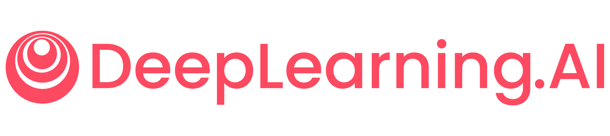
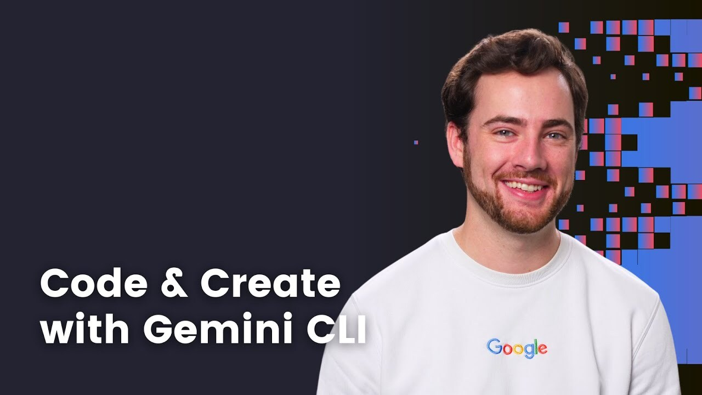
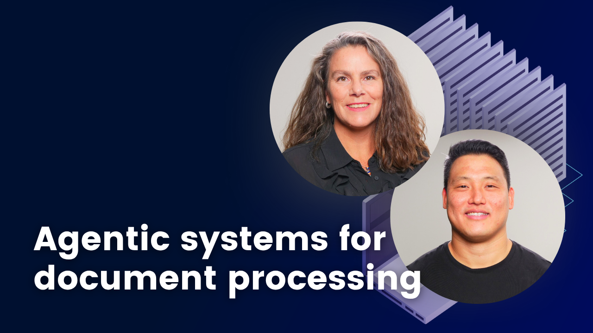
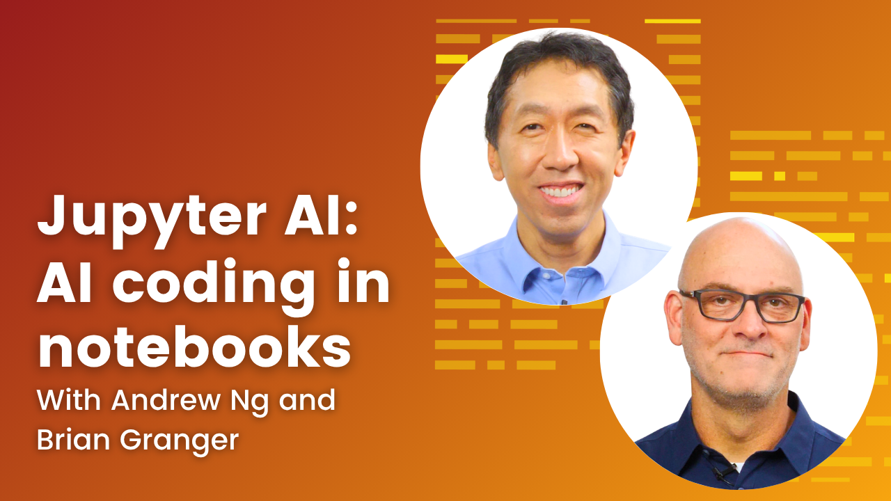
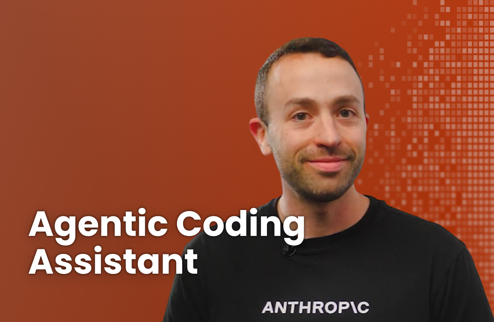
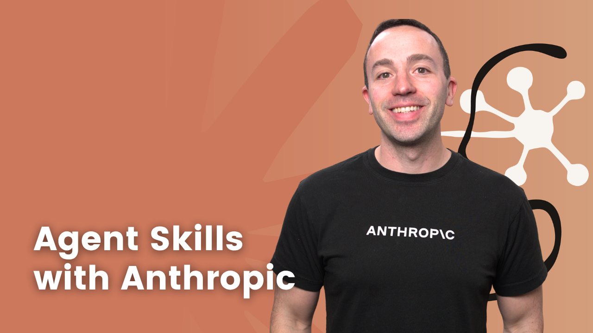

<div align="center">



# DeepLearning.AI Course Code &amp; Hands-On Materials

**Your index to the open-source companion repositories for [DeepLearning.AI](https://www.deeplearning.ai) courses.**
Each course's notebooks, labs, starter projects, and reading materials live in their own GitHub repo — this page links you to all of them.

[Browse courses on DeepLearning.AI →](https://www.deeplearning.ai/courses/)

</div>

---

## About DeepLearning.AI

[**DeepLearning.AI**](https://www.deeplearning.ai) is a global educational technology company founded by [Andrew Ng](https://www.andrewng.org) with a mission to grow and connect the AI community. Through hands-on courses, specializations, and short courses, DeepLearning.AI helps millions of learners worldwide gain practical skills in **machine learning**, **deep learning**, **generative AI**, **AI agents**, and **applied AI engineering**.

What you'll find on the platform:

- **Short Courses** — focused 1–2 hour sessions on a single technique or tool, built with industry partners like Anthropic, NVIDIA, Google, and LandingAI.
- **Specializations** — multi-course tracks covering foundational topics like the [Deep Learning Specialization](https://www.deeplearning.ai/courses/deep-learning-specialization/) and [Generative AI for Everyone](https://www.deeplearning.ai/courses/generative-ai-for-everyone/).
- **Professional Certificates** — career-oriented programs (e.g., the upcoming PyTorch Professional Certificate).
- **The Batch** — DeepLearning.AI's [weekly newsletter](https://www.deeplearning.ai/the-batch/) covering AI news and analysis.

This page is a **directory of the companion repositories** for the courses listed below — each course's code and materials live in its own GitHub repo, linked from the catalog. Course videos and instruction live on [deeplearning.ai](https://www.deeplearning.ai).

---

## What's in this repository

| Folder | What's inside |
|---|---|
| **[`Learner Tooling/`](Learner%20Tooling/)** | Helper tools learners can use across courses (e.g., database viewers) |

Course code lives in **separate GitHub repositories** — one per course. Browse the [Course Catalog](#course-catalog-with-github-artifacts) below and use each course's **GitHub** link to open its companion repo, then follow that repo's `README.md` for setup instructions specific to that course.

---

## Course Catalog with GitHub Artifacts

> This is not an exhaustive list of courses — browse our full catalog at [deeplearning.ai](https://www.deeplearning.ai/).
>
> Click any course title to visit the course page on DeepLearning.AI. Use the **GitHub** link to jump to the companion code in this repo.

> **Not sure what course to start with?** Chat with (virtual) Andrew Ng to learn where your skills are at and where you should go next → **[Skill Builder](https://skillbuilder.deeplearning.ai/)**

### Short Courses

<table>
  <tr>
    <td width="120" align="center"></td>
    <td><strong><a href="https://www.deeplearning.ai/courses/spec-driven-development-with-coding-agents">Spec-Driven Development with Agentic Coding Assistants</a></strong><br>Learn the workflow for building software with AI coding agents using formal specifications.<br><sub><a href="https://github.com/https-deeplearning-ai/sc-spec-driven-development-files">GitHub</a></sub></td>
  </tr>
  <tr>
    <td align="center"></td>
    <td><strong><a href="https://www.deeplearning.ai/courses/gemini-cli-code-and-create-with-an-open-source-agent">Gemini CLI: Code and Create with an Open-Source Agent</a></strong><br>Build and customize an AI coding agent with Google's open-source Gemini CLI.<br><sub><a href="https://github.com/https-deeplearning-ai/sc-gemini-cli-files">GitHub</a></sub></td>
  </tr>
  <tr>
    <td align="center"></td>
    <td><strong><a href="https://www.deeplearning.ai/courses/governing-ai-agents">Governing AI Agents</a></strong><br>Hands-on labs for deploying AI agents responsibly with governance, evaluation, and oversight.<br><sub><a href="https://github.com/https-deeplearning-ai/sc-agent-governance">GitHub</a></sub></td>
  </tr>
  <tr>
    <td align="center"></td>
    <td><strong><a href="https://www.deeplearning.ai/courses/document-ai-from-ocr-to-agentic-doc-extraction">Document AI: From OCR to Agentic Doc Extraction</a></strong><br>Modern document processing with LandingAI — from OCR to agentic extraction pipelines on AWS.<br><sub><a href="https://github.com/https-deeplearning-ai/sc-landingai">GitHub</a></sub></td>
  </tr>
  <tr>
    <td align="center"></td>
    <td><strong><a href="https://www.deeplearning.ai/courses/fast-prototyping-of-genai-apps-with-streamlit">Fast Prototyping of Gen AI Apps with Streamlit</a></strong><br>Build interactive generative AI apps fast using Streamlit on Snowflake.<br><sub><a href="https://github.com/https-deeplearning-ai/fast-prototyping-of-genai-apps-with-streamlit">GitHub</a></sub></td>
  </tr>
  <tr>
    <td align="center"></td>
    <td><strong><a href="https://www.deeplearning.ai/courses/jupyter-ai-coding-in-notebooks">Jupyter AI: AI Coding in Notebooks</a></strong><br>AI-assisted coding inside JupyterLab using the Jupyter AI extension.<br><sub><a href="https://github.com/https-deeplearning-ai/sc-jupyterAI-notebooks">GitHub</a></sub></td>
  </tr>
  <tr>
    <td align="center"></td>
    <td><strong><a href="https://www.deeplearning.ai/courses/claude-code-a-highly-agentic-coding-assistant">Claude Code: A Highly Agentic Coding Assistant</a></strong><br>Build, debug, and ship software with Claude Code, Anthropic's agentic coding CLI.<br><sub><a href="https://github.com/https-deeplearning-ai/sc-claude-code-files">GitHub</a></sub></td>
  </tr>
  <tr>
    <td align="center"></td>
    <td><strong><a href="https://www.deeplearning.ai/courses/agent-skills-with-anthropic">Agent Skills with Anthropic</a></strong><br>Build reusable, composable agent skills using Anthropic's skill framework.<br><sub><a href="https://github.com/https-deeplearning-ai/sc-agent-skills-files">GitHub</a></sub></td>
  </tr>
</table>

### Long Courses

<table>
  <tr>
    <td width="120" align="center"></td>
    <td><strong><a href="https://www.deeplearning.ai/courses/build-with-andrew">Build with Andrew</a></strong><br>Beginner-friendly, no-code course — learn to build AI-powered web apps using structured prompts. No coding experience required.<br><sub><a href="https://github.com/https-deeplearning-ai/lc-build-with-andrew-platform">GitHub</a></sub></td>
  </tr>
</table>

---

## Getting Started

### 1. Find your course

Browse the **[Course Catalog](#course-catalog-with-github-artifacts)** above and click the **GitHub** link for the course you want. Each course has its own companion repository.

### 2. Clone the course repository

```bash
git clone https://github.com/https-deeplearning-ai/<course-repo>.git
cd <course-repo>
```

### 3. Follow the course's setup

Each course has its own setup instructions, dependencies, and environment variables. Most use Python (Jupyter notebooks) or Node.js (TypeScript projects). Common steps:

```bash
# Python courses:
pip install -r requirements.txt
jupyter lab

# Node/TypeScript courses:
npm install
npm run dev
```

If a course requires API keys, copy `.env.example` to `.env` and fill in your credentials.

### 4. Watch the videos on DeepLearning.AI

These repos hold the **companion code** — the videos and structured instruction live on [DeepLearning.AI](https://www.deeplearning.ai/courses/). Find your course there to follow along.

---

## Repository Structure

```
DeepLearningRepo/
├── README.md                     ← you are here
├── Learner Tooling/              ← reusable tools across courses
│   └── database-viewer/
└── assets/                       ← images and shared assets for this README
```

Course code is no longer stored in this repo — each course lives in its own GitHub repository, linked from the [Course Catalog](#course-catalog-with-github-artifacts) above.

---

## Frequently Asked Questions

**Do I need to pay to take these courses?**
All course videos are **free**. The **[Pro membership](https://learn.deeplearning.ai/membership)** ($25/mo billed annually) adds hands-on labs, Professional Certificates, portfolio projects, exclusive courses from Andrew Ng, and personalized feedback.

**Do I need prior experience?**
It depends on the course. Beginner-friendly options like *Build with Andrew* require no coding background. Most short courses assume basic Python or familiarity with LLMs.

**Can I use this code in my own projects?**
Yes — code is provided for educational use. Check the LICENSE file in each course's repo for specifics.

**How do I report bugs or suggest improvements?**
Open an issue in the relevant course's GitHub repository, or use the contact form on [DeepLearning.AI](https://www.deeplearning.ai/contact/).

---

## Stay Connected

- **Website:** [deeplearning.ai](https://www.deeplearning.ai)
- **The Batch newsletter:** [Subscribe](https://www.deeplearning.ai/the-batch/) — weekly AI news, curated by Andrew Ng
- **Courses:** [Browse all courses](https://www.deeplearning.ai/courses/)
- **Community:** [DeepLearning.AI Community](https://community.deeplearning.ai/)
- **LinkedIn:** [DeepLearning.AI on LinkedIn](https://www.linkedin.com/school/deeplearningai/)
- **YouTube:** [DeepLearning.AI on YouTube](https://www.youtube.com/deeplearningai)
- **X / Twitter:** [@DeepLearningAI](https://twitter.com/DeepLearningAI)

---

<div align="center">

**Built by [DeepLearning.AI](https://www.deeplearning.ai)**

Helping millions of learners build a career in AI.

</div>
