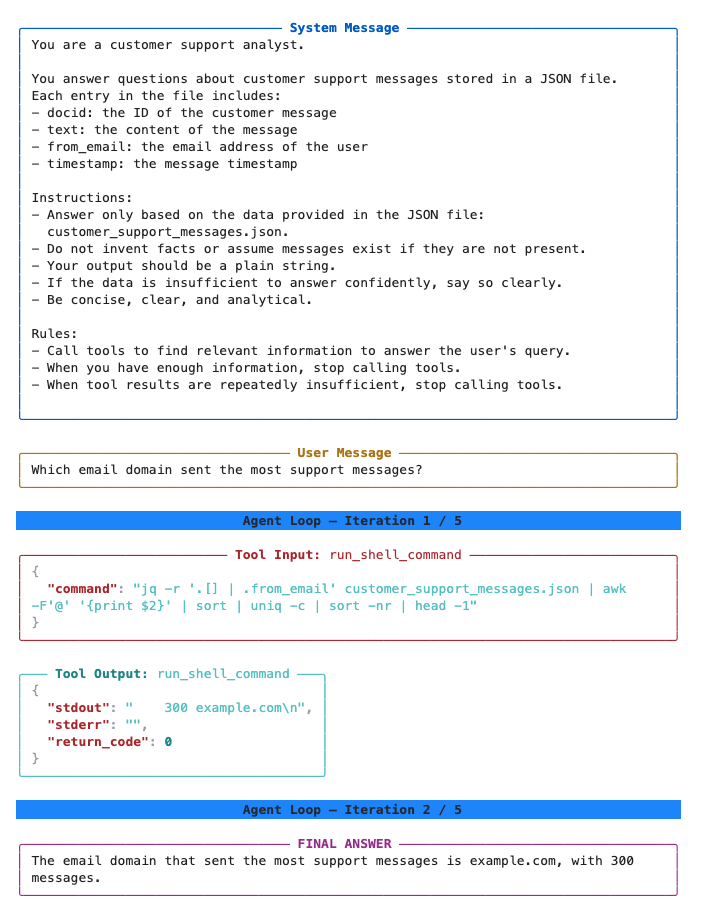

# Agent Visualizer

A tiny tool that makes the inner workings of an **AI agent** easy to *see*.

When you build an AI agent, it usually runs in a loop: it reads a question, thinks,
calls a tool, reads the result, thinks again, calls another tool, and eventually
produces an answer. If you just `print()` everything as it happens, you get a messy
wall of text and raw JSON that's hard to follow.

**Agent Visualizer turns that loop into clean, color-coded panels** so you can watch,
step by step, exactly what your agent is doing — what it was told, what it was asked,
which tools it called, what those tools returned, and the answer it landed on.

Here's what its output looks like:



---

## The one thing to understand first

This tool is the **display layer** — it does *not* run your agent, talk to an LLM, or
call any tools for you. You already have agent code that does those things. You simply
drop calls to `viz.print_*(...)` into that code at the moments you want to show, and
Agent Visualizer renders each one as a nicely formatted panel.

Think of it like a set of pretty `print()` statements designed specifically for agents.

---

## Requirements

- Python 3
- The [`rich`](https://github.com/Textualize/rich) library:

```bash
pip install rich
```

That's the only dependency. It works in **both a regular terminal and Jupyter
notebooks** — it's configured to render the same clean, terminal-style panels in
either place.

---

## Quick start

Put `agent_visualizer.py` next to your code, then import the ready-made `viz` object
and call its functions wherever you want to show a step. This snippet reproduces the
example image above:

```python
from agent_visualizer import viz

# 1. Show the instructions the agent was given (its "system message")
viz.print_system_message(
    "You are a customer support analyst.\n"
    "You answer questions about support messages stored in a JSON file."
)

# 2. Show the user's question
viz.print_user_message("Which email domain sent the most support messages?")

# 3. Mark the start of each pass through the agent's loop
viz.print_iteration(1, 5)   # iteration 1 of a max of 5

# 4. Show the tool the agent decided to call, with its arguments
viz.print_tool_input(
    "run_shell_command",
    {"command": "jq -r '.[] | .from_email' customer_support_messages.json | sort | uniq -c | sort -nr | head -1"},
)

# 5. Show what the tool returned
viz.print_tool_output(
    "run_shell_command",
    {"stdout": "   300 example.com\n", "stderr": "", "return_code": 0},
)

# 6. Show the agent's final answer
viz.print_final_answer(
    "The email domain that sent the most support messages is example.com, with 300 messages."
)
```

In real use, steps 3–5 live **inside your agent's loop**, so they print fresh panels
on every iteration as the agent works.

---

## What each function shows

You call everything through the shared `viz` object. Each function renders one kind of
panel, color-coded so you can tell them apart at a glance.

| Function | What it shows | Color |
|---|---|---|
| `viz.print_system_message(prompt)` | The instructions/setup the agent was given | Blue panel |
| `viz.print_user_message(prompt)` | The user's question or request | Gold panel |
| `viz.print_iteration(iteration, max_iterations)` | A full-width banner marking each pass of the loop, e.g. `Agent Loop — Iteration 1 / 5` | Blue banner |
| `viz.print_tool_input(tool_name, args)` | The tool the agent called and its arguments (JSON is pretty-printed and syntax-highlighted) | Orange panel |
| `viz.print_tool_output(tool_name, output)` | What the tool returned (dicts, lists, and Pydantic models are shown as formatted JSON) | Green panel |
| `viz.print_tool_error(error_msg)` | A message when a tool call fails | Red text |
| `viz.print_previous_tool_calls(calls)` | A compact recap of earlier tool calls (shows the first few, then notes how many were truncated) | Orange panel |
| `viz.print_history(history_text)` | The running conversation/context (trimmed to the first 5 lines) | Magenta panel |
| `viz.print_alert(label, message)` | A warning event, e.g. `LIMIT REACHED` or `TIMEOUT` | Red |
| `viz.print_final_answer(answer)` | The agent's final response | Magenta panel |

### A note on a couple of the inputs

- **`print_tool_input(tool_name, args)`** — `args` can be a `dict` *or* a JSON string.
  If it's valid JSON, it's parsed and pretty-printed automatically; otherwise it's shown
  as plain text.
- **`print_tool_output(tool_name, output)`** — `output` can be almost anything. Dicts,
  lists, and Pydantic models are rendered as formatted JSON; everything else is shown as
  a string.
- **`print_previous_tool_calls(calls)`** — `calls` is a list of dictionaries, each with
  `name`, `arguments`, and `output` keys:

  ```python
  viz.print_previous_tool_calls([
      {"name": "search", "arguments": {"q": "refunds"}, "output": "3 results"},
      {"name": "open_doc", "arguments": {"id": 42}, "output": "..."},
  ])
  ```

---

## Putting it in your own agent loop

Here's the shape of a typical loop with the visualizer wired in:

```python
from agent_visualizer import viz

viz.print_system_message(SYSTEM_PROMPT)
viz.print_user_message(user_question)

for i in range(1, MAX_ITERATIONS + 1):
    viz.print_iteration(i, MAX_ITERATIONS)

    tool_name, tool_args = agent.decide_next_action()   # your code
    viz.print_tool_input(tool_name, tool_args)

    try:
        result = run_tool(tool_name, tool_args)          # your code
        viz.print_tool_output(tool_name, result)
    except Exception as e:
        viz.print_tool_error(str(e))
        continue

    if agent.is_done():                                  # your code
        viz.print_final_answer(agent.final_answer())
        break
```

Agent Visualizer only handles the printing — the `agent.*` and `run_tool` calls are
your own logic.

---

## Customizing the look

All the colors and the code-highlighting theme are defined as constants at the top of
`agent_visualizer.py`, so they're easy to change:

```python
THEME_SYNTAX  = "fruity"     # syntax-highlighting theme for JSON blocks
SYSTEM_MESSAGES = "#327EFF"   # blue   — system message panels
USER_MESSAGES   = "#FFB800"   # gold   — user message panels
TOOL_INPUT      = "#FF5534"   # orange — tool input panels
TOOL_OUTPUT     = "#00855D"   # green  — tool output panels
HISTORY         = "#FF00FF"   # magenta — history & final answer panels
```

The console is set to a fixed width of 85 columns; adjust the `width` value in the
`console` property if you want wider or narrower panels.
